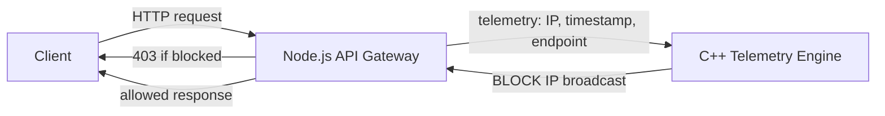
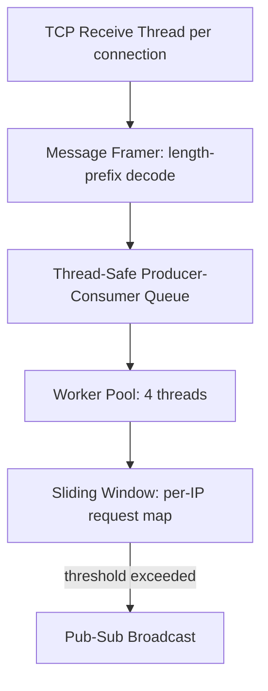
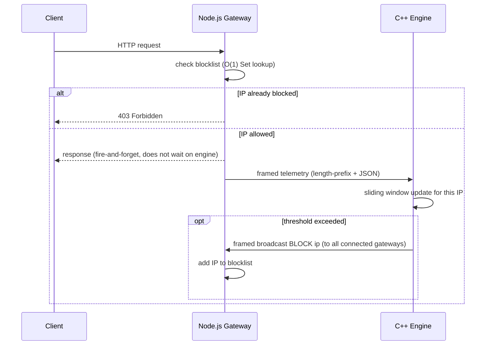

# High-Performance Telemetry & Anomaly Detection Engine

A two-service system that detects high-frequency bot/request-flood traffic in real time and blocks it at the gateway, before it reaches the actual application. Built to understand what's actually happening underneath tools like rate limiters and message queues, not just to call a library and move on.

## The problem

Most rate-limiting happens at the application layer, which is already slow by the time a request has made it that far. This project moves detection closer to the network layer: a Node.js gateway forwards lightweight telemetry (IP, timestamp, endpoint) to a standalone C++ engine over a raw TCP socket. The engine tracks per-IP request frequency using a sliding window, and the moment an IP crosses a threshold, it broadcasts a block command back to every connected gateway in real time.

## Architecture



Inside the engine:



### Request lifecycle (single message, end to end)



## What each service does

**C++ Telemetry Engine**
- Multithreaded raw TCP server: one long-lived "receptionist" thread accepts connections, spawning a tracked handler thread per client
- Custom thread-safe Producer-Consumer queue feeding a 4-thread worker pool
- Sliding-window algorithm (`unordered_map<ip, queue<timestamp>>`) with O(1) lookups per IP
- Pub/Sub-style broadcast: on detecting an anomaly, the engine publishes a `BLOCK:<ip>` message to every connected gateway without needing to know who's listening

**Node.js API Gateway**
- Express middleware checks an in-memory blocklist (`Set`, O(1) lookup) before allowing a request through
- Fire-and-forget telemetry: writes to the engine without blocking the HTTP response
- Fails open: if the engine is unreachable, the gateway keeps serving legitimate traffic rather than blocking everyone — a detection outage should never become its own denial-of-service
- Reconnects to the engine with exponential backoff; drops (rather than queues) telemetry while disconnected, since a delayed block command has no operational value once the attack window has passed

## The core engineering problem: TCP has no message boundaries

TCP guarantees ordered delivery of bytes, not messages. Multiple small writes can be coalesced by the OS into a single read on the receiving end, and a single write can just as easily arrive split across several reads. This surfaced early as a real bug: a batch of JSON telemetry messages arrived at the engine glued into one string, breaking the parser.

The fix was a custom **length-prefix framing protocol**: every message is preceded by 4 bytes stating its exact byte length, so the receiver always knows exactly where one message ends and the next begins, regardless of how TCP chooses to batch or split the underlying bytes. This was implemented on both sides of both connections — C++ engine and Node.js gateway, for both the telemetry direction and the alert-broadcast direction — and verified with a purpose-built test client that deliberately sends messages glued together and deliberately split into small delayed chunks.

## Debugging real concurrency bugs

- **Shutdown deadlock:** the accept-loop thread blocks indefinitely inside `accept()`. A plain shutdown flag doesn't help, since a thread blocked in a system call doesn't check application-level state. Fixed by forcibly closing the listening socket on shutdown, which unblocks `accept()` immediately.
- **Heap corruption under load:** a crash that only appeared under heavy concurrent load, diagnosed with GDB. The root cause was a double-close race — the destructor was force-closing client sockets during shutdown while detached handler threads, unaware the object was being torn down, tried to close the very same sockets independently. Fixed by switching from detached threads to tracked, joined threads with an atomic shutdown flag, and by making "check if socket still exists, close it, remove it" a single atomic operation under one lock, rather than three separate steps that could interleave with another thread's cleanup.

## Load testing

Tested end-to-end with `autocannon` against the live HTTP gateway (including real telemetry forwarding to the engine on every request, not a stripped-down version):

| Concurrent connections | Avg req/sec | p99 latency |
|---|---|---|
| 600 | ~5,300 | ~194 ms |
| 1000 | ~5,100–6,700 | ~660 ms |
| 1500 | ~5,400 | ~650 ms |
| 2000 | ~6,600 | ~1.6 s |
| 3000 | ~4,000 | ~1.97 s |

Throughout every run, the engine's internal message queue depth was monitored directly and stayed at or near zero — confirming the detection algorithm itself was never the bottleneck, even as gateway-side latency grew at higher concurrency. Degradation past ~2000–3000 connections traces to the gateway/infrastructure layer (single-threaded event loop, single shared socket to the engine, and test-machine resource limits when running multiple load generators simultaneously), not the sliding-window detection logic.

## Known limitations (honest, not yet built)

- **Single-IP detection only.** The sliding window keys on individual IP addresses, so it catches one source flooding requests, but not a distributed botnet spreading low request volume across many IPs.
- **No cap on declared message length yet.** A malicious client could claim an enormous length prefix and force a large memory allocation. Identified, not yet mitigated.
- **No idle-connection timeout.** A client that opens a connection and trickles data slowly (a Slowloris-style attack) could hold a thread/socket open indefinitely. Identified, not yet mitigated.

## Tech stack

C++17, raw Winsock/POSIX sockets, `std::thread`/`std::mutex`, nlohmann/json — Node.js, Express, raw `net` sockets.

## Running it locally

```
# C++ engine
g++ src/*.cpp -o engine.exe -lws2_32 -lpthread -std=c++17
./engine.exe

# Node.js gateway
npm install
node server.js
```

Set `PORT`, `ENGINE_HOST`, and `ENGINE_PORT` in a `.env` file for the gateway.